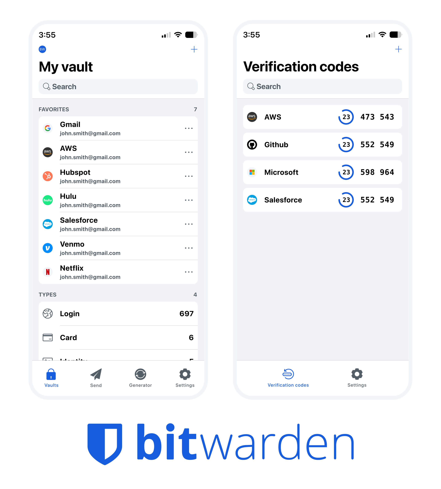

    <picture>
        <source media="(prefers-color-scheme: dark)" srcset=".github/images/ios-dark.png">
        <source media="(prefers-color-scheme: light)" srcset=".github/images/ios-light.png">
        
    </picture>

    
    
    
    

---

# Bitwarden iOS Password Manager & Authenticator Apps

Please refer to the [iOS section](https://contributing.bitwarden.com/getting-started/mobile/ios/) of the [Contributing Documentation](https://contributing.bitwarden.com/) for build instructions, recommended tooling, code style tips, and lots of other great information to get you started.

## Related projects:

- [bitwarden/server](https://github.com/bitwarden/server): The core infrastructure backend (API, database, Docker, etc).
- [bitwarden/clients](https://github.com/bitwarden/clients): Non-mobile Bitwarden Clients Applications.
- [bitwarden/directory-connector](https://github.com/bitwarden/directory-connector): A tool for syncing a directory (AD, LDAP, Azure, G Suite, Okta) to an organization.

# We're Hiring!

Interested in contributing in a big way? Consider joining our team! We're hiring for many positions. Please take a look at our [Careers page](https://bitwarden.com/careers/) to see what opportunities are [currently open](https://bitwarden.com/careers/#open-positions) as well as what it's like to work at Bitwarden.

# Contribute

Code contributions are welcome! Please commit any pull requests against the `main` branch. Learn more about how to contribute by reading the [Contributing Guidelines](https://contributing.bitwarden.com/contributing/). Check out the [Contributing Documentation](https://contributing.bitwarden.com/) for how to get started with your first contribution.

Security audits and feedback are welcome. Please open an issue or email us privately if the report is sensitive in nature. You can read our security policy in the [`SECURITY.md`](SECURITY.md) file.